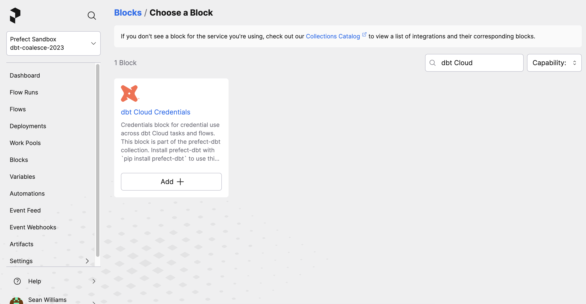

# dbt and Prefect: a Quick Tutorial

dbt has revolutionized the way analysts and engineers transform data within data warehouses, and has become an essential component in modern data pipelines.  

As part of those pipelines, dbt jobs often rely on data from flaky, brittle, or slow upstream processes.  

In this tutorial, I'll share three different ways to run your dbt jobs with Prefect and tie it together to demonstrate how the combination of Prefect and dbt can tighten up pipelines to deliver results faster.


## Three ways to run dbt with Prefect

To be able to increase visibility and react to upstream processes, we first need to get your dbt job running as a Prefect flow.  To run this code yourself, feel free to clone the repository from https://github.com/seanpwlms/prefect-dbt-demo

## Getting started: 

Create a virtual environment, activate it, and install the requirements.
```bash
python3.10 -m venv "env"
source env/bin/activate
pip install -r requirements.txt
```

Then create a free [Prefect Cloud](https://www.prefect.io/) account and authenticate your terminal by running `prefect cloud login` 

### dbt Cloud

To trigger a dbt Cloud job from Prefect, you'll need to add a [block](https://docs.prefect.io/2.13.5/concepts/blocks/) by navigating to the Blocks page and searching for a "dbt Cloud Credentials" block. Add the block and complete the form with your dbt Cloud Account ID and your dbt Cloud API key.  



Now, update the `JOB_ID` variable in `prefect_dbt_cloud.py` with the dbt Cloud job ID you want to run.  Later you can move this ID to be stored in a [Prefect variable](https://docs.prefect.io/2.13.5/guides/variables/) as needed.

```python
from prefect_dbt.cloud import DbtCloudCredentials
from prefect_dbt.cloud.jobs import trigger_dbt_cloud_job_run
from prefect import flow

@flow
def cloud_job(JOB_ID = 424466):
    dbt_cloud_credentials = DbtCloudCredentials.load("dbt-cloud-creds")
    trigger_dbt_cloud_job_run(dbt_cloud_credentials=dbt_cloud_credentials, job_id=JOB_ID)

if __name__ == "__main__":
    cloud_job()

```

Running `python prefect_dbt_cloud.py` in your terminal will trigger that dbt Cloud job to run immediately. As a bonus, if you let your trial lapse and forget to add a payment method, Marvin AI error summaries can let you know about it. 

### dbt Core

If you're already running dbt Core, you can run your dbt jobs a few different ways. The following examples will work on Snowflake sample data, but you might want to replace the project and profiles directories in the examples that follow with those that fit your existing project.

#### Using prefect-dbt

By supplying a `profiles.yml` directory, and the directory of your dbt project, you can quickly trigger a job and see the logs in Prefect.

```python
from prefect_dbt.cli.commands import DbtCoreOperation
from prefect import flow

@flow
def trigger_dbt_flow() -> str:
    result = DbtCoreOperation(
        commands=["dbt build -t prod"],
        project_dir="prefect_demo",
        profiles_dir="~/.dbt"
    ).run()
    return result

if __name__ == "__main__":
    trigger_dbt_flow()

```

#### Using prefect-dbt-flow

[Dataroots](https://dataroots.io/) has recently created a library to use Prefect and dbt Core, with added benefits, such as being able to display model execution in the timeline view. For this you'll need to run `pip install prefect-dbt-flow`

```python

from pathlib import Path
from prefect.task_runners import SequentialTaskRunner
from prefect_dbt_flow import dbt_flow
from prefect_dbt_flow.dbt import DbtProfile, DbtProject

my_dbt_flow = dbt_flow(
    project=DbtProject(
        name="sample_project",
        project_dir=Path() / "prefect_demo",
        profiles_dir=Path.home() / ".dbt",
    ),
    profile=DbtProfile(
        target="prod",
    ),
    flow_kwargs={
        "task_runner": SequentialTaskRunner(),
    },
)

if __name__ == "__main__":
    my_dbt_flow()
```


### Something slightly more realistic

Let's say you have a daily dbt job that takes an average of two hours to run, but data arrives 10 minutes late 10% of the time. This causes your freshness checks to fail after two hours, wasting Snowflake credits, and blocking your stakeholders. With cron-based scheduling, this is common and annoying.  With Prefect, you can bring your ingestion processes, such as running Airbyte, into the same flow so that your dbt job only gets triggered on successful completion of that job.  

But what if you don't have control over that ingestion process? Let's run a quick check to see if we have fresh data.  If we do, great, run the dbt job.  If not, let's wait a bit and notify us if it's not there after 15 minutes.


```python
from prefect_dbt.cloud import DbtCloudCredentials
from prefect_dbt.cloud.jobs import trigger_dbt_cloud_job_run
from prefect import flow, task
from prefect_snowflake.database import SnowflakeConnector
from prefect.states import Failed

snowflake_connector = SnowflakeConnector.load("snowflake-demo-connector")

@flow
def cloud_job(JOB_ID = 424466):
    dbt_cloud_credentials = DbtCloudCredentials.load("dbt-cloud-creds")
    trigger_dbt_cloud_job_run(dbt_cloud_credentials=dbt_cloud_credentials, job_id=JOB_ID)

@task
def count_recent_cc_records():
    result = snowflake_connector.fetch_one(
        "select cc_rec_start_date > current_date - 1 as is_fresh, max(cc_rec_start_date) as max_date from snowflake_sample_data.tpcds_sf10tcl.call_center group by 1"
    )
    return result

@flow(retries = 3, retry_delay_seconds = 300, log_prints = True)
def daily_job():
    fresh_data = count_recent_cc_records()
    if fresh_data[0]:
        cloud_job()
    else:
        return Failed(message = f'Stale data: most recent date is {str(fresh_data[1])}')

if __name__ == "__main__":
    daily_job()

```

This will return a Failed state, with a message displaying the most recent date.  I've also configured a Prefect notification to email me if this flow fails for any reason.  

If you want to get an idea of how things have been going over time, you can log in and have a look at the dashboard.  


These examples are simple starting points, but hopefully they give you an idea of how combining Prefect and dbt can help teams move faster and manage problems like unexpected or late data.  